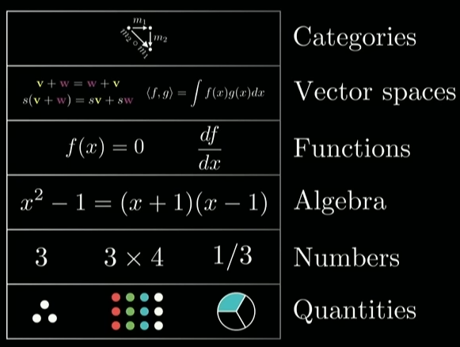

# Generalization and Specialization

## How to generalize: thinking abstractly

- Here, we can add logic as an external meta-abstraction that applies to ALL of these.
  - With arrows pointing from Logic to each one.

- Start with real-world, often physical, observations of objects,
- Remove "special properties" (or "context") from the real world:
  - If you are looking at a picture with three different lions, remove their differences,
  - and then remove their "animalness", etc.
  - this is called making it "context-free".
- Look for:
  - relations between them,
  - operations that act on them,
  - properties they might have.
  - This is the most difficult part and cannot be taught completely.
- Now see if the objects can be replaced with others.
  - Do the properties / relations still hold?
- Now see if the operations could be replaced with others:
  - Do they still work?

[Back to Elements](README.md#abstraction)